---
## Front matter
title: "Лабораторная работа №2"
subtitle: дисциплина "Архитектура компьютера"
author: "Комаров Владимир Артемович"

## Generic otions
lang: ru-RU
toc-title: "Содержание"

## Bibliography
bibliography: bib/cite.bib
csl: pandoc/csl/gost-r-7-0-5-2008-numeric.csl

## Pdf output format
toc: true # Table of contents
toc-depth: 2
lof: true # List of figures
lot: true # List of tables
fontsize: 12pt
linestretch: 1.5
papersize: a4
documentclass: scrreprt
## I18n polyglossia
polyglossia-lang:
  name: russian
  options:
	- spelling=modern
	- babelshorthands=true
polyglossia-otherlangs:
  name: english
## I18n babel
babel-lang: russian
babel-otherlangs: english
## Fonts
mainfont: IBM Plex Serif
romanfont: IBM Plex Serif
sansfont: IBM Plex Sans
monofont: IBM Plex Mono
mathfont: STIX Two Math
mainfontoptions: Ligatures=Common,Ligatures=TeX,Scale=0.94
romanfontoptions: Ligatures=Common,Ligatures=TeX,Scale=0.94
sansfontoptions: Ligatures=Common,Ligatures=TeX,Scale=MatchLowercase,Scale=0.94
monofontoptions: Scale=MatchLowercase,Scale=0.94,FakeStretch=0.9
mathfontoptions:
## Biblatex
biblatex: true
biblio-style: "gost-numeric"
biblatexoptions:
  - parentracker=true
  - backend=biber
  - hyperref=auto
  - language=auto
  - autolang=other*
  - citestyle=gost-numeric
## Pandoc-crossref LaTeX customization
figureTitle: "Рис."
tableTitle: "Таблица"
listingTitle: "Листинг"
lofTitle: "Список иллюстраций"
lotTitle: "Список таблиц"
lolTitle: "Листинги"
## Misc options
indent: true
header-includes:
  - \usepackage{indentfirst}
  - \usepackage{float} # keep figures where there are in the text
  - \floatplacement{figure}{H} # keep figures where there are in the text
---

# Цель работы

Целью данной работы является изучение идеологии и применения средств
контроля версий, а также приобретение практических навыков по работе с
системой git

# Задание

1. Настройка GitHub.
2. Базовая настройка Git.
3. Создание SSH-ключа.
4. Создание рабочего пространства и репозитория курса на основе
шаблона.
5. Создание репозитория курса на основе шаблона.
6. Настройка каталога курса.
7. Выполнение заданий для самостоятельной работы.

# Теоретическое введение

Системы контроля версий (Version Control System, VCS) применяются при ра-
боте нескольких человек над одним проектом. Обычно основное дерево проекта
хранится в локальном или удалённом репозитории, к которому настроен до-
ступ для участников проекта. При внесении изменений в содержание проекта
система контроля версий позволяет их фиксировать, совмещать изменения, про-
изведённые разными участниками проекта, производить откат к любой более
ранней версии проекта, если это требуется. В классических системах контроля
версий используется централизованная модель, предполагающая наличие еди-
ного репозитория для хранения файлов. Выполнение большинства функций по
управлению версиями осуществляется специальным сервером. Участник про-
екта (пользователь) перед началом работы посредством определённых команд
получает нужную ему версию файлов. После внесения изменений пользователь
размещает новую версию в хранилище. При этом предыдущие версии не уда-
ляются из центрального хранилища и к ним можно вернуться в любой момент.
Сервер может сохранять не полную версию изменённых файлов, а производить
так называемую дельта-компрессию — сохранять только изменения между по-
следовательными версиями, что позволяет уменьшить объём хранимых данных.
Системы контроля версий поддерживают возможность отслеживания и
разреше- ния конфликтов, которые могут возникнуть при работе нескольких
человек над одним файлом. Можно объединить изменения, сделанные разными
участниками, вручную выбрать нужную версию, отменить изменения вовсе или
заблокиро- вать файлы для изменения. В зависимости от настроек блокировка
не позволяет другим пользователям получить рабочую копию или препятствует
изменению рабочей копии файла средствами файловой системы ОС,
обеспечивая таким образом привилегированный доступ только одному
пользователю, работающему с файлом. Системы контроля версий также могут
обеспечивать дополнительные, более гибкие функциональные возможности.
Например, они могут поддерживать работу с несколькими версиями одного
файла, сохраняя общую историю измене- ний до точки ветвления версий и
собственные истории изменений каждой ветви. Обычно доступна информация о
том, кто из участников, когда и какие изменения вносил. Обычно такого рода
информация хранится в журнале изменений, доступ к которому можно
ограничить. В отличие от классических, в распределённых системах контроля
версий центральный репозиторий не является обязательным. Среди
классических VCS наиболее известны CVS, Subversion, а среди распреде-
лённых — Git, Bazaar, Mercurial. Принципы их работы схожи, отличаются они в
5основном синтаксисом используемых в работе команд. Система контроля
версий Git представляет собой набор программ командной строки. Доступ к
ним можно получить из терминала посредством ввода команды git с
различными опциями. Благодаря тому, что Git является распределённой
системой контроля версий, резервную копию локального хранилища можно
сделать простым копированием или архивацией. Работа пользователя со своей
веткой начинается с проверки и получения изменений из центрального
репозитория (при этом в локальное дерево до начала этой процедуры не должно
было вноситься изменений). Затем можно вносить изменения в локальном
дереве и/или ветке. После завершения внесения какого-то изменения в файлы
и/или каталоги проекта необходимо разместить их в центральном репозитории.

# Выполнение лабораторной работы

1. Настройка Github
На гитхабе у меня уже была учётная запись и поэтому создавать новую мне не пришлось.

2. Базовая настройка git
Открываю виртуальную машину, затем открываю терминал и делаю пред- варительную
конфигурацию git. Ввожу команду git config –global “user.name”, указывая свое имя и команду
git config –global user.email “work@mail”, указывая в ней электронную почту владельца, то
есть мою.
Настраиваю utf-8 в выводе сообщений git для корректного отображения символов.
Задаю имя «master» для начальной ветки.
Задаю параметр autocrlf со значением input, так как я работаю в системе Linux, чтобы
конвертировать CRLF в LF только при коммитах. CR и LF – это сим- волы, которые можно
использовать для обозначения разрыва строки в текстовых файлах.
Задаю параметр safecrlf со значением warn, так Git будет проверять преоб- разование на
обратимость. При значении warn Git только выведет предупреждение, но будет принимать
необратимые конвертации.

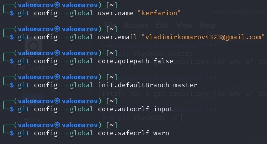{#fig:001 width=70%}

3. Создание SSH-ключа
Для последующей идентификации пользователя на сервере репозиториев необ-
ходимо сгенерировать пару ключей (приватный и открытый). Для этого ввожу 
команду ssh-keygen -C “Имя Фамилия, work@email”, указывая имя владельца и
электронную почту владельца (рис. 4.2). Ключ автоматически сохранится в
каталоге ~/.ssh/.

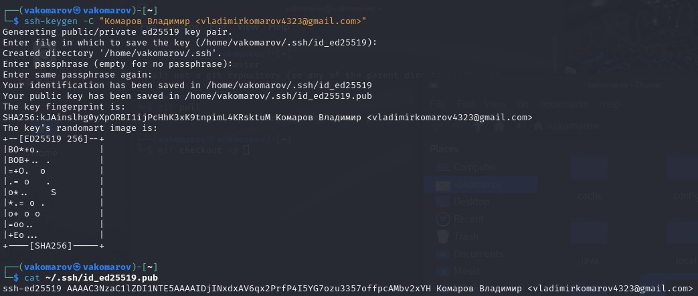{#fig:002 width=70%}

Копирую ключ из открытой директории в которой он был, перехожу на сайт
Github и добавляю там новый SSH-ключ

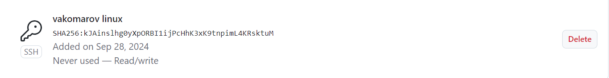{#fig:003 width=70%}

4. Создание рабочего пространства и репозитория курса
на основе шаблона
Закрываю браузер, открываю терминал. Создаю директорию, рабочее пространство, с
помощью утилиты mkdir, блягодаря ключу -p создаю все директории после домашней
~/work/study/2022-2023/“Архитектура компьютера” рекурсивно.

{#fig:004 width=70%}

5. Создание репозитория курса на основе шаблона
В браузере перехожу на страницу репозитория с шаблоном курса по адресу
https://github.com/yamadharma/course-directory-student-template. Далее выбираю
«Use this template», чтобы использовать этот шаблон для своего репозитория.
В открывшемся окне задаю имя репозитория (Repository name): study_2022–
2023_arh- pc и создаю репозиторий, нажимаю на кнопку «Create repository from
template».

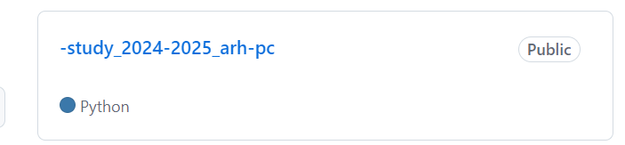{#fig:005 width=70%}

Через терминал перехожу в созданный каталог курса и клонирую созданный
репозиторий с помощью команды git clone –recursive
git@github.com:/study_2024–2025_arh-pc.git arch-pc (рис. 4.6)

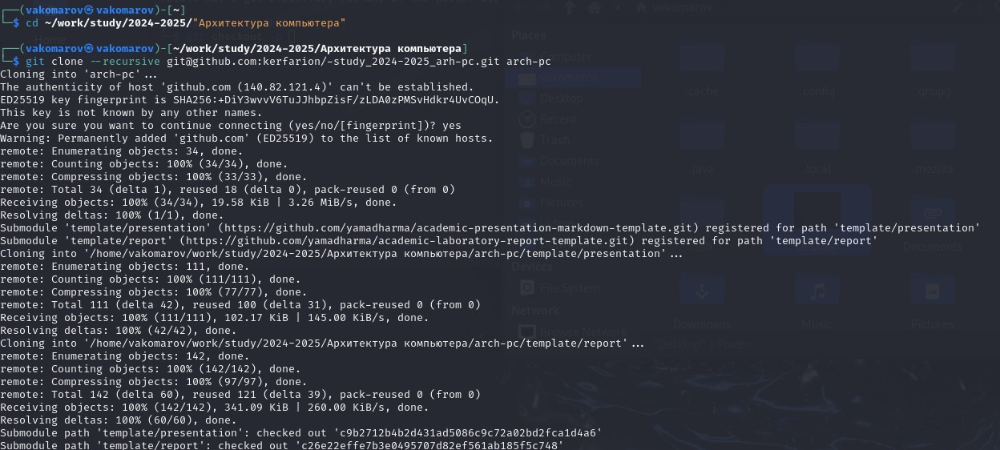{#fig:006 width=70%}

6. Настройка каталога курса
Перехожу в каталог arch-pc с помощью утилиты cd
Удаляю лишние файлы с помощью утилиты rm
Создаю необходимые каталоги
Отправляю созданные каталоги с локального репозитория на сервер: добавляю
все созданные каталоги с помощью git add, комментирую и сохраняю изменения
на сервере как добавление курса с помощью git commit (рис. 4.7, 4.8).

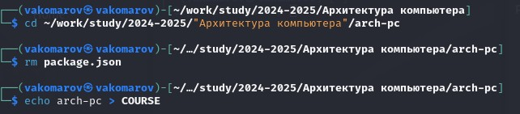{#fig:007 width=70%}

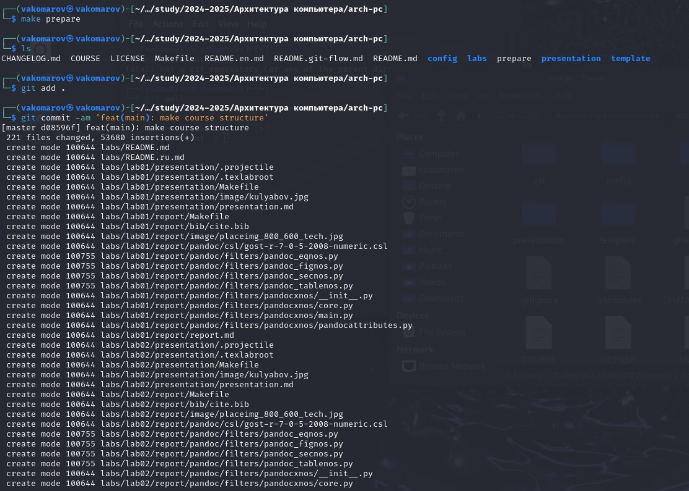{#fig:008 width=70%}

С помощью команды push выгружаем всё на сервер

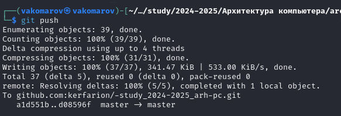{#fig:009 width=70%}

Проверяю правильность выполнения работы сначала на самом сайте GitHub.

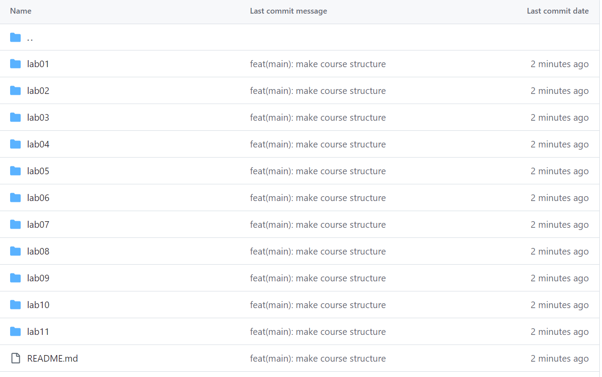{#fig:010 width=70%}

7. Выполнение заданий для самостоятельной работы
Перехожу в директорию labs/lab03/report с помощью утилиты cd. Создаю в
каталоге файл для отчета по третьей лабораторной работе с помощью утилиты
touch, после чего перехожу в директорию labs/lab01/report(рис. 4.11).

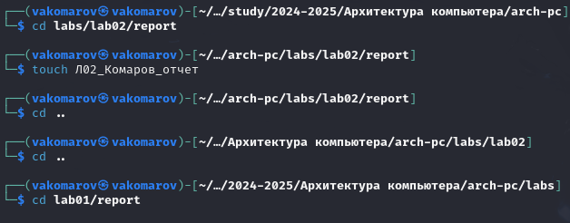{#fig:011 width=70%}

Проверяю местонахождение файла с отчетом по первой лабораторной работой.
Он должн быть в подкаталоге домашней директории «Загрузки», для проверки
использую команду ls

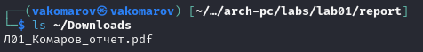{#fig:012 width=70%}

Копирую первую лабораторную с помощью утилиты cp и проверяю правиль-
ность выполнения команды cp с помощью ls

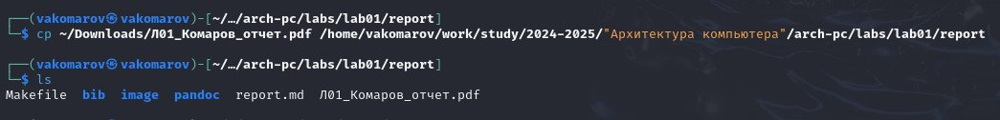{#fig:013 width=70%}

После чего добавляю файл в add
Сохраняю изменения на сервере командой git commit -m “…”, поясняя,
что добавил файлы.

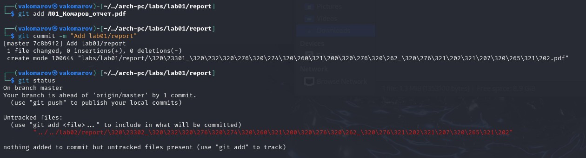{#fig:014 width=70%}

Аналогично я поступаю с отчётом по этой лабораторной работе, после чего
отправляю коммит на сервер.

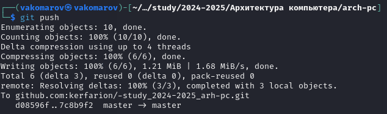{#fig:015 width=70%}

Вижу, что отчеты по лабораторным работам находятся в соответствующих
каталогах репозитория: отчет по первой - в lab01/report

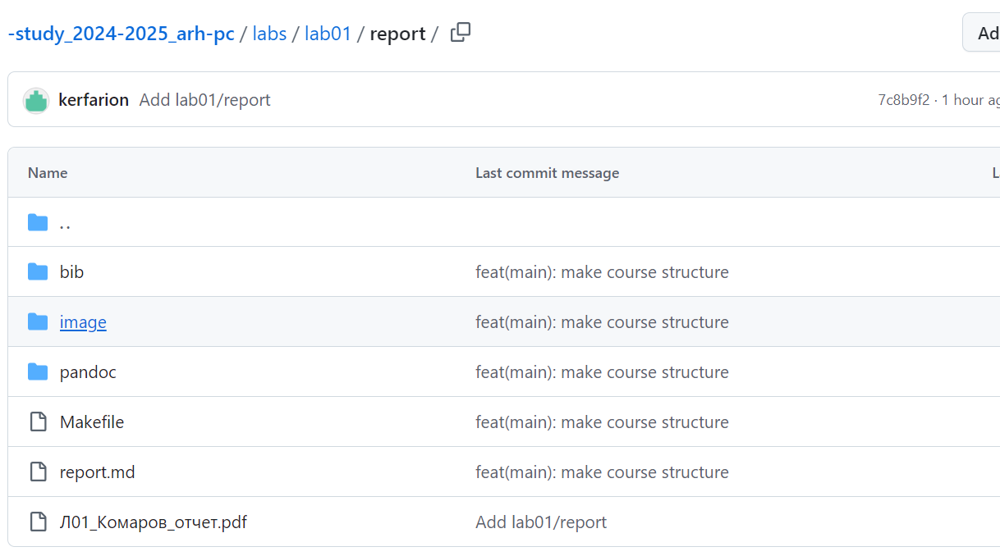{#fig:016 width=70%}

# Вывод

При выполнении данной лабораторной работы я изучила идеологию и
применение средств контроля версий, а также приобрела практические навыки
по работе с системой git.

