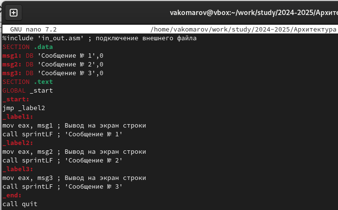
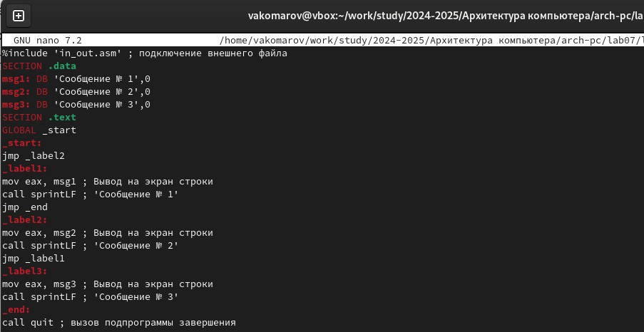
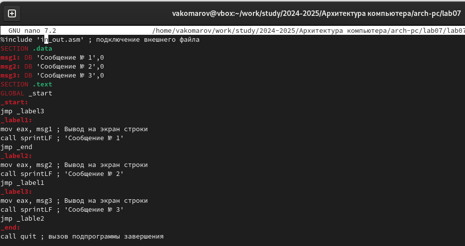
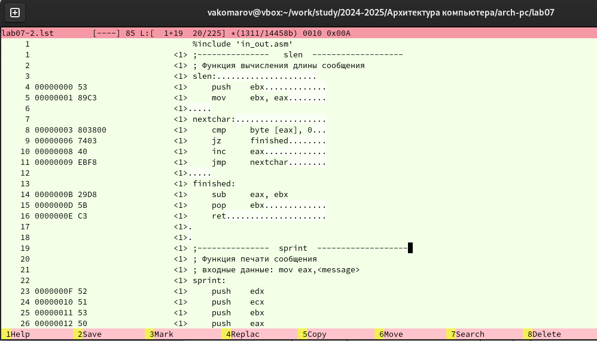
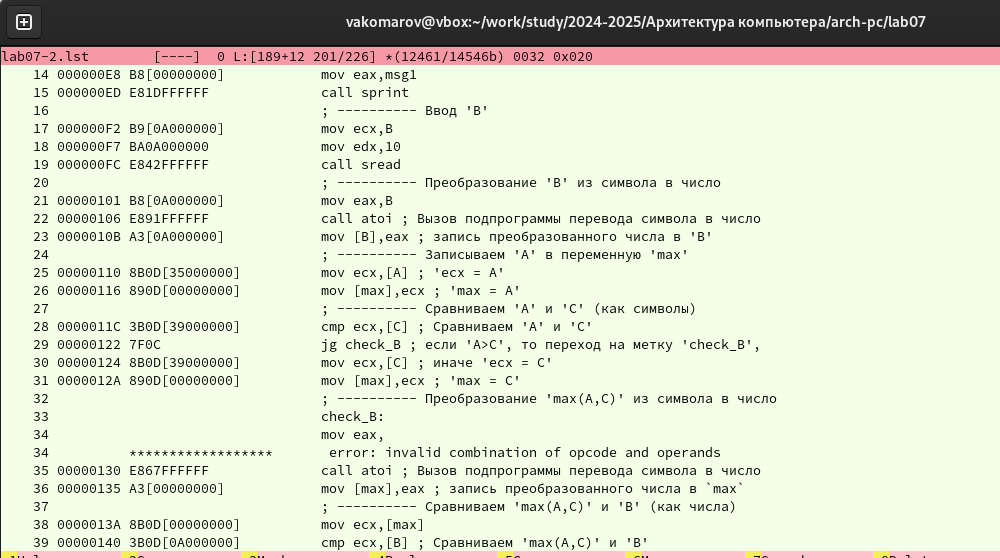
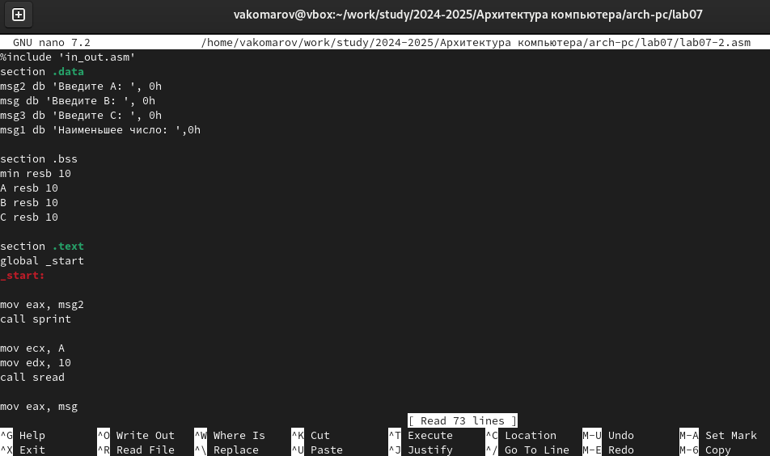
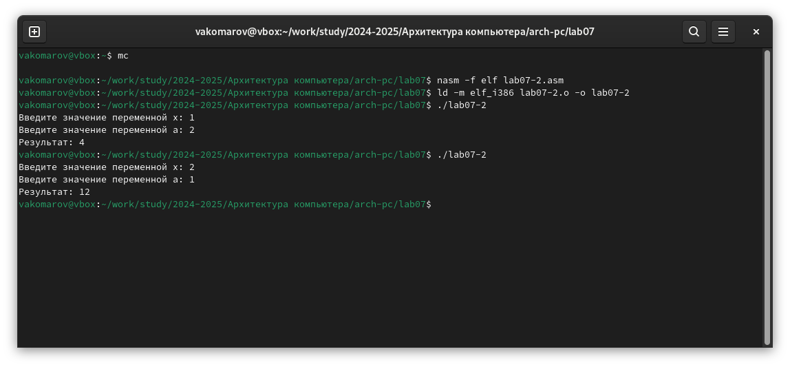

---
## Front matter
title: "Отчет по Лабораторной работе №7"
subtitle: "дисциплина: Архитектура компьютера"
author: "Комаров Владимир Артемович"

## Generic otions
lang: ru-RU
toc-title: "Содержание"

## Bibliography
bibliography: bib/cite.bib
csl: pandoc/csl/gost-r-7-0-5-2008-numeric.csl

## Pdf output format
toc: true # Table of contents
toc-depth: 2
lof: true # List of figures
lot: true # List of tables
fontsize: 12pt
linestretch: 1.5
papersize: a4
documentclass: scrreprt
## I18n polyglossia
polyglossia-lang:
  name: russian
  options:
	- spelling=modern
	- babelshorthands=true
polyglossia-otherlangs:
  name: english
## I18n babel
babel-lang: russian
babel-otherlangs: english
## Fonts
mainfont: IBM Plex Serif
romanfont: IBM Plex Serif
sansfont: IBM Plex Sans
monofont: IBM Plex Mono
mathfont: STIX Two Math
mainfontoptions: Ligatures=Common,Ligatures=TeX,Scale=0.94
romanfontoptions: Ligatures=Common,Ligatures=TeX,Scale=0.94
sansfontoptions: Ligatures=Common,Ligatures=TeX,Scale=MatchLowercase,Scale=0.94
monofontoptions: Scale=MatchLowercase,Scale=0.94,FakeStretch=0.9
mathfontoptions:
## Biblatex
biblatex: true
biblio-style: "gost-numeric"
biblatexoptions:
  - parentracker=true
  - backend=biber
  - hyperref=auto
  - language=auto
  - autolang=other*
  - citestyle=gost-numeric
## Pandoc-crossref LaTeX customization
figureTitle: "Рис."
tableTitle: "Таблица"
listingTitle: "Листинг"
lofTitle: "Список иллюстраций"
lotTitle: "Список таблиц"
lolTitle: "Листинги"
## Misc options
indent: true
header-includes:
  - \usepackage{indentfirst}
  - \usepackage{float} # keep figures where there are in the text
  - \floatplacement{figure}{H} # keep figures where there are in the text
---

# Цель работы

Изучение команд условного и безусловного переходов. Приобретение навыков
написания программ с использованием переходов. Знакомство с назначением и
структурой файла листинга.

# Задание

1. Напишите программу нахождения наименьшей из 3 целочисленных пере-
менных a,b и . Значения переменных выбрать из табл. 7.5 в соответствии с
вариантом, полученным при выполнении лабораторной работы № 7. Со-
здайте исполняемый файл и проверьте его работу.
2. Напишите программу, которая для введенных с клавиатуры значений x
и a вычисляет значение заданной функции f(x) и выводит результат вы-
числений. Вид функции f(x) выбрать из таблицы 7.6 вариантов заданий в
соответствии с вариантом, полученным при выполнении лабораторной ра-
боты № 7. Создайте исполняемый файл и проверьте его работу для значений
x и a из 7.6.

# Теоретическое введение

# Выполнение лабораторной работы

## Реализация переходов в NASM

1. Создаю каталог для программ лабораторной работы №7, перехожу в него и
создаю файл lab7-1.asm.

{#fig:001 width=70%}

2. Ввожу в файл lab7-1.asm текст программы из листинга 7.1. Запускаю исполняемый файл.

{#fig:002 width=70%}

{#fig:003 width=70%}

3. Изменим текст программы так, чтобы она сначала выводила “Сообщение №2”, потом “Сообщение №1” и завершала работу. Запустим исправленную программу.

{#fig:004 width=70%}

{#fig:005 width=70%}

4. Изменим текст программы так, чтобы она выводила сначала "Сообщение №1", потом "Сообщение №2" и после этого "Сообщение №1" и завершала работу. Запустим исправленную программу

{#fig:006 width=70%}

{#fig:007 width=70%}

5. Создадим файл lab7-2.asm. Введем в файл текст программы из листинга 7.3.
Программа определяет и выводит на экран наибольшую из целочисленных переменных A, B, C. Значения для A, C задаются в программе, значение  вводится с клавиатуры. Запускаю исполняемый файл.

{#fig:008 width=70%}

{#fig:009 width=70%}

## Изучение структуры файлы листинга

6. Создаю файл листинга для программы из файла lab7-2.asm. Открываю файл листинга в любом текстовом редакторе.

{#fig:010 width=70%}

7. Объясняю три строчки из файла листинга: 23 00000106 E891FFFFFF call atoi - Вызов подпрограммы перевода символа в число; 23 - номер строки, 00000106 - адрес, E891FFFFFF - машинный код; 41 0000014B 7F0C jg fin - переход на label ‘fin’, если ‘max(A,C)>B’; 41 - номер строки, 0000014B - адрес, 7F0C - машинный код; 50 0000016D E869FFFFFF call quit - Выход из программы; 50 - номер строки; 0000016D - адрес; E869FFFFFF - машинный код.

8. Открываю файл с программой lab7-2.asm и в одной из инструкций с двумя операндами удаляю один операнд. Транслирую файл с текстом программы с получением файла листинга. Я не получаю выходных файлов, программа выдает ошибку, так как в данной операции должны присутствовать два операнда, а не один.

{#fig:011 width=70%}

# Задания для самостоятельной работы

1. Создаю файл lab7-3.asm и ввожу в него текст программы для нахождения наименьшей из трех целочисленных переменных a, b, c. Мой вариант 10. Программа работает корректно.

{#fig:012 width=70%}

{#fig:013 width=70%}

2. Создаю файл lab7-4.asm и ввожу в него текст программы,которая для введенных с клавиатуры значений x и a вычисляет значение заданной функции и выводит результат вычислений. Мой вариант - 10.

{#fig:014 width=70%}

{#fig:015 width=70%}

# Выводы

В результате выполнения лабораторной работы я изучил команды условного
и безусловного переходов, а так же приобрёл навыки написания программ с
использованием переходов. Познакомился с назначением и структурой файла
листинга.

# Список литературы{.unnumbered}

